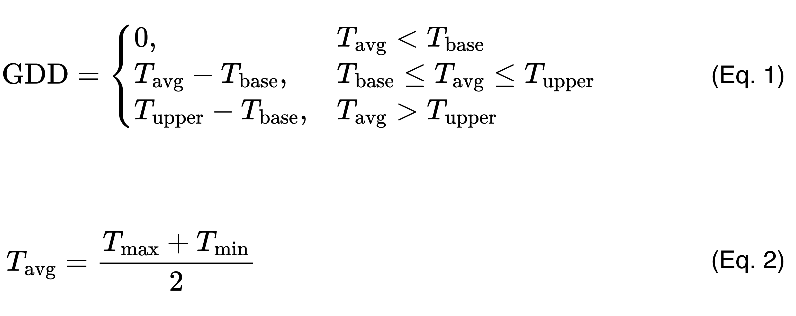
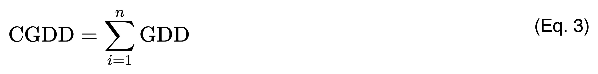
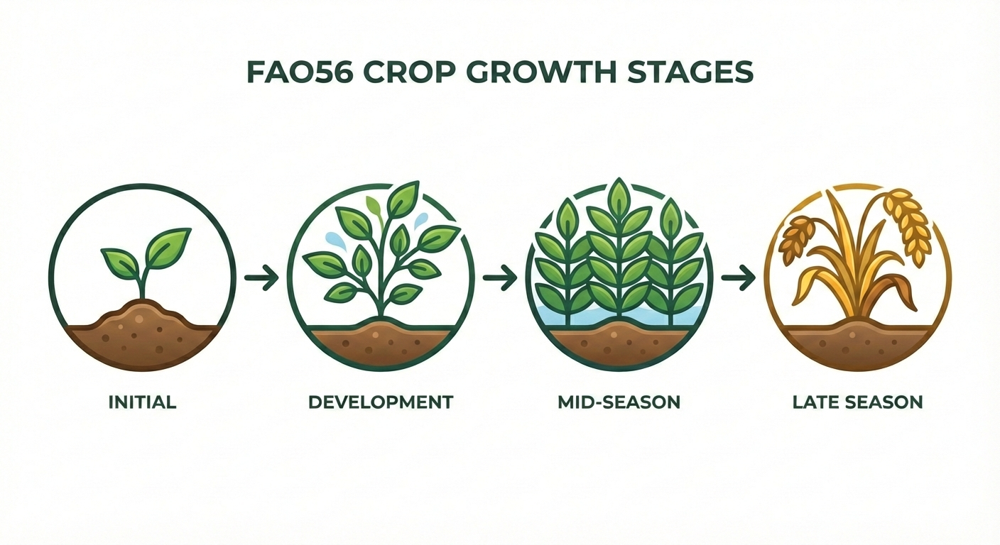
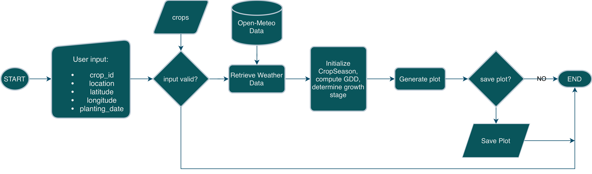
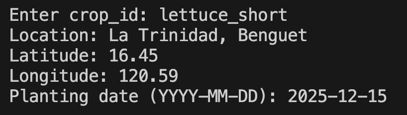
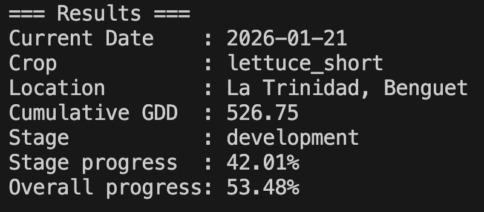
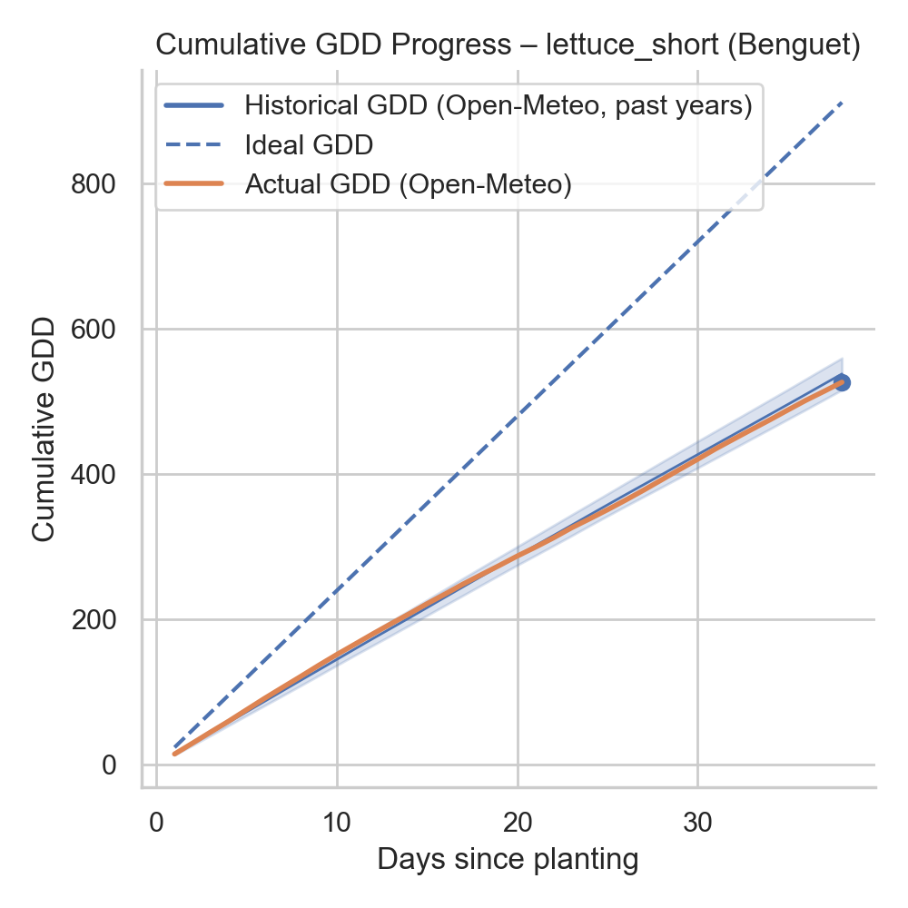

#### Danilo III O. Gonzales (29225)
#### Master's in Green Data Science
### Project in Introduction to Python

# Growing Degree Days (GDD) and Crop Phenology Estimation of a Cropping Season

## Project Description

This project implements a Python-based tool to compute the growing degree days (GDD) and determine the current crop growth stage (phenology) for selected vegetable and field crops. The model uses daily air temperature data retrieved from the Open-Meteo API and applies crop-specific thermal thresholds derived from the revised FAO56 guidelines (FAO56rev).

Unlike cropping calendar-based approaches, this project estimates crop development using cumulative thermal time, providing a biologically meaningful representation of crop growth.

### Project File Structure

- **`project.py`** – Main program file containing data retrieval from Open-Meteo, GDD computation, crop growth stage estimation, visualization, and the `CropSeason` class.

- **`crops_data.py`** – Defines crop-specific thermal parameters and cumulative GDD thresholds for phenological stages.

- **`test_project.py`** – Implements unit tests using `pytest` to verify GDD calculations, growth stage logic, class behavior, and error handling.

- **`requirements.txt`** – Lists all Python dependencies required to run the project.

- **`README.md`** – Provides project background, methodology, workflow, inputs and outputs, limitations, future work, and references.

### Growing Degree Days (GDD)

Growing Degree Days (GDD) quantify accumulated thermal time for crop growth using daily air temperature relative to crop-specific base and upper thresholds. Daily GDD values are zero below the base temperature, increase linearly between thresholds, and are capped above the upper threshold. Cumulative GDD from planting indicates crop progress independent of calendar time and is used to estimate phenological stages, schedule management operations, and predict harvest timing.

GDD are calculated using a piecewise temperature-threshold approach (Paredes et al., 2025). Equation 1 expresses daily GDD as a function of mean air temperature relative to crop-specific base and upper thresholds. Equation 2 defines mean air temperature as the average of daily maximum and minimum temperatures.

**where:**

- **GDD** is the growing degree days  
- **Tmax (°C)** is the daily maximum air temperature  
- **Tmin (°C)** is the daily minimum air temperature  
- **Tavg (°C)** is the daily mean air temperature  
- **Tbase (°C)** is the base temperature below which crop development ceases  
- **Tupper (°C)** is the upper temperature threshold above which crop development no longer increases

While daily GDD values describe short-term thermal accumulation, crop development is more accurately represented by the cumulative sum of GDD over time. Cumulative Growing Degree Days (CGDD), as shown in Equation 3,  are obtained by summing daily GDD values from the planting date onward and serve as a thermal-time proxy for crop phenological progression.

**where:**

- **CGDD** is the cumulative growing degree days  
- **GDDi** is the growing degree days on day *i*  
- **n** is the number of days elapsed since planting

In this project, cumulative GDD is used as the primary indicator for estimating the progress of the current crop season. Because CGDD integrates the effects of daily temperature variability, it provides a more biologically consistent measure of crop development than calendar-based approaches, particularly under variable or changing climatic conditions.

### FAO-56 Crop Growth Stages

The FAO-56 framework defines crop development as a sequence of four generalized growth stages: initial, development, mid-season, and late season. The initial stage begins immediately after planting and is characterized by slow growth and limited canopy development. During the development stage, vegetative growth accelerates as leaf area expands and thermal accumulation increases rapidly. The mid-season stage corresponds to effective full canopy cover and sustained physiological activity, during which crop development progresses at a relatively steady rate. Finally, the late-season stage marks the transition toward maturity, as growth slows, senescence begins, and the crop approaches harvest. In this project, these stages are represented using crop-specific cumulative Growing Degree Day (GDD) thresholds, allowing phenological progression to respond dynamically to temperature conditions rather than fixed calendar dates (Pereira et al., 2025).

**Figure 1**  
*FAO-56 Crop Growth Stage* 

### Weather Data Source
Open-Meteo is an open-access weather API that provides historical and forecast data (Zippenfenig, 2023). This program uses Open-Meteo to obtain daily minimum and maximum air temperatures for a specified location. These temperatures are used to calculate GDD and estimate crop growth stages.

### Program Workflow Overview

The program's overall workflow is illustrated in Figure 2. The process begins with user-provided inputs that define the crop type, location, and planting date. These inputs are validated before being used to retrieve daily temperature data from the Open-Meteo weather database. The retrieved weather data are then used to initialize a CropSeason object, within which daily and cumulative Growing Degree Days (GDD) are computed, and the current crop growth stage is determined. The program subsequently generates a visualization of GDD progression and prompts the user to save the plot, if desired. This workflow highlights the model's sequential structure, from data input and validation to computation, visualization, and output generation.

**Figure 2**  
*Flowchart of GDD-Based Crop Season Modeling* 

#### Inputs
1. `crop_id` - identifies the crop to be modeled and determines the crop-specific temperature requirements as well as cumulative GDD thresholds used for phenological stage estimation.
2. `location` - descriptive name used for labeling outputs and saved figures.
3. `latitude` - specifies the north-south position of the field location and is required for retrieving temperature data from Open-Meteo.
4. `longitude` - specifies the east-west position of the field location and is required for retrieving temperature data from Open-Meteo.
5. `planting_date` - Defines the start of the growing season and serves as the reference date for accumulating daily and cumulative GDD.

**Figure 3**  
*Example Input* 

#### Outputs and Visualization

The program produces two types of outputs:
1. The first one is the **textual summary** showing the current date, crop type, location, cumulative GDD, estimated growth stage, and progress within the stage.  

**Figure 4**  
*Example Textual Summary Output* 
 

2. The second output is the **GDD Progress Plot**. When selected by the user (by responding “y” to the prompt), the program generates a plot showing the historical cumulative GDD distribution based on Open-Meteo temperature data, an ideal GDD trajectory assuming optimal thermal conditions, and the actual cumulative GDD for the current season.  

**Figure 5**  
*Example GDD Progress Plot Output* 

#### Testing

Unit tests were implemented using `pytest` and are located in `test_project.py`.  
The tests verify the correctness of the GDD calculation, phenological stage determination, `CropSeason` class behavior, and error handling for invalid inputs.

### Limitations

This program evaluates crop development only from the user-defined planting date up to the current date, using available historical temperature data to estimate cumulative Growing Degree Days (GDD) and the present phenological stage. As a result, the model is intended primarily as a tool for monitoring current-season crop performance rather than for full-season forecasting or yield prediction. 

### References

Paredes, P., López-Urrea, R., Martínez-Romero, Á., Petry, M., do Rosário Cameira, M., Montoya, F., … Pereira, L. S. (2025). Estimating the lengths of crop growth stages to define the crop coefficient curves using growing degree days (GDD): Application of the revised FAO56 guidelines. *Agricultural Water Management*, 319, 109758. [doi:10.1016/j.agwat.2025.109758](https://doi.org/10.1016/j.agwat.2025.109758)

Pereira, L. S., Allen, R. G., Paredes, P., López-Urrea, R., Raes, D., Smith, M., Kilic, A., & Salman, M. (2025). Crop evapotranspiration: Guidelines for computing crop water requirements (FAO Irrigation and Drainage Paper No. 56rev). Food and Agriculture Organization of the United Nations. https://www.fao.org/4/x0490e/x0490e00.htm

Zippenfenig, P. (2023). Open-Meteo.com Weather API [Computer software]. Zenodo. https://doi.org/10.5281/ZENODO.7970649